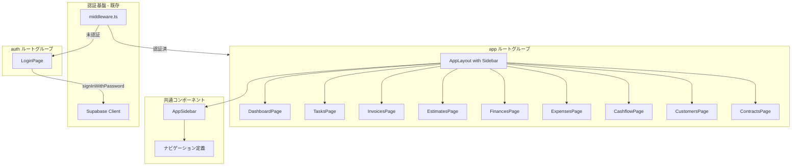
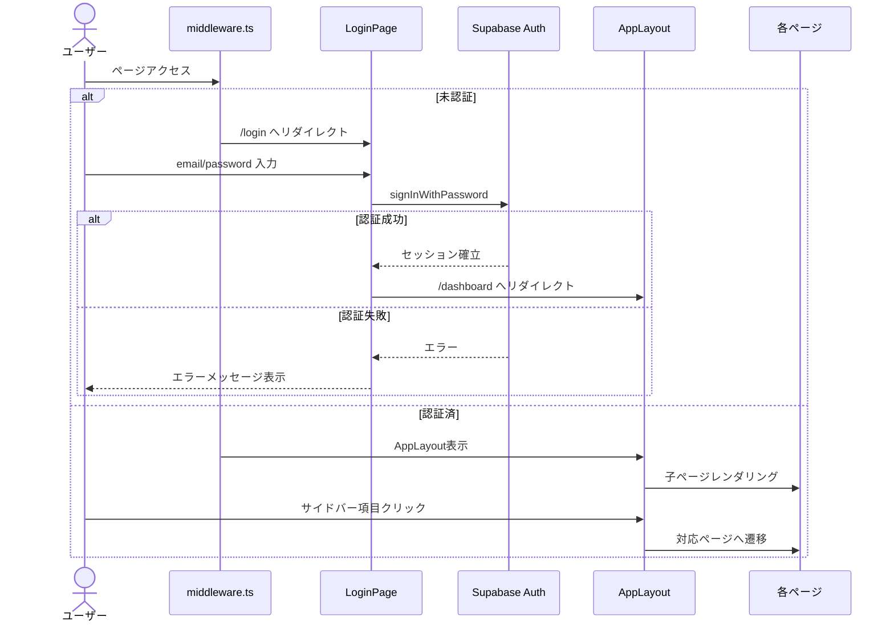

# Design Document: layout-navigation

## Overview

**Purpose**: 本機能は、tos-sys（個人利用の会社管理システム）の全ページに共通するレイアウト基盤を提供する。認証付きサイドバーレイアウト、9項目のナビゲーション、ログインページを構築し、全機能ページの入り口となるUI構造を確立する。

**Users**: システムの唯一のユーザー（管理者）が、サイドバーから各業務機能へ素早くアクセスするために使用する。

**Impact**: 現在のフラット構造のルーティングを `(app)` / `(auth)` ルートグループに再構成し、全ページにサイドバー付きレイアウトを適用する。

### Goals
- 認証フロー（ログイン・リダイレクト）の完全な動作
- 9項目のサイドバーナビゲーションとアクティブハイライト
- デスクトップ・モバイル両対応のレスポンシブレイアウト
- 全機能ページのプレースホルダー作成とルーティング確立

### Non-Goals
- ユーザー登録（signup）機能
- ダッシュボードの実際のコンテンツ・KPI表示
- 各機能ページの実装（プレースホルダーのみ）
- ログアウト機能（本スコープ外、後続issueで対応）

## Architecture

### Existing Architecture Analysis

現在のアーキテクチャ:
- **認証基盤**: `middleware.ts` + `lib/supabase/middleware.ts` で未認証リダイレクトが実装済み
- **Supabaseクライアント**: `lib/supabase/client.ts`（ブラウザ）、`auth-server.ts`（サーバー）が存在
- **UIコンポーネント**: `button`, `input`, `label`, `select` が `components/ui/` に存在
- **ルート構成**: `app/receipts/` がルートグループ外に存在（移動対象）
- **制約**: middleware.tsのmatcher設定は既にログインページを除外済みのため変更不要

### Architecture Pattern & Boundary Map



**Architecture Integration**:
- Selected pattern: Next.js App Router ルートグループによるレイアウト分離
- Domain boundaries: `(auth)` はログイン専用（サイドバーなし）、`(app)` はサイドバー付き認証済みページ
- Existing patterns preserved: middleware認証ガード、Supabaseクライアント、shadcn/uiコンポーネント
- New components rationale: AppSidebar（ナビゲーション集約）、LoginForm（認証UIカプセル化）
- Steering compliance: サーバーコンポーネントがデフォルト、`"use client"` は必要な場合のみ

### Technology Stack

| Layer | Choice / Version | Role in Feature | Notes |
|-------|------------------|-----------------|-------|
| Frontend | Next.js 16 + React 19 | ルートグループ、レイアウト、ページ | 既存 |
| UI | shadcn/ui Sidebar | サイドバーコンポーネント群 | 新規追加。Sheet, Collapsible が依存 |
| Authentication | Supabase Auth | email/password認証 | 既存。`signInWithPassword` 使用 |
| Styling | Tailwind CSS v4 | レスポンシブ対応 | 既存 |

## System Flows

### 認証・ナビゲーションフロー



## Requirements Traceability

| Requirement | Summary | Components | Interfaces | Flows |
|-------------|---------|------------|------------|-------|
| 1.1 | ログイン成功→ダッシュボードリダイレクト | LoginForm | LoginFormProps | 認証フロー |
| 1.2 | 認証失敗→エラー表示 | LoginForm | LoginFormProps | 認証フロー |
| 1.3 | 認証済み→ダッシュボードリダイレクト | LoginPage | - | 認証フロー |
| 2.1 | 未認証→/loginリダイレクト | middleware.ts（既存） | - | 認証フロー |
| 2.2 | 認証済み→アクセス許可 | middleware.ts（既存） | - | 認証フロー |
| 3.1 | 9項目ナビゲーション表示 | AppSidebar, NavItems | NavItem | - |
| 3.2 | ナビ項目クリック→ページ遷移 | AppSidebar | NavItem | - |
| 3.3 | アクティブページハイライト | AppSidebar | NavItem | - |
| 4.1 | デスクトップ: サイドバー常時表示 | AppLayout | - | - |
| 4.2 | モバイル: ハンバーガーメニュー | AppLayout | - | - |
| 4.3 | モバイル: オーバーレイサイドバー | AppLayout | - | - |
| 5.1 | shadcn/ui Sidebar使用 | AppLayout, AppSidebar | - | - |
| 5.2 | 全子ページに共通レイアウト | AppLayout | - | - |
| 6.1 | 9ルートのページ作成 | PlaceholderPages | - | - |
| 6.2 | / → /dashboard リダイレクト | RootRedirect | - | - |
| 6.3 | プレースホルダーコンテンツ | PlaceholderPages | - | - |
| 7.1 | ログインフォームUI | LoginForm | LoginFormProps | - |
| 7.2 | (auth)ルートグループ配置 | LoginPage | - | - |
| 7.3 | ローディング状態・二重押下防止 | LoginForm | LoginFormProps | - |

## Components and Interfaces

| Component | Domain/Layer | Intent | Req Coverage | Key Dependencies | Contracts |
|-----------|-------------|--------|--------------|-----------------|-----------|
| AppLayout | Layout | サイドバー付き認証済みレイアウト | 4.1-4.3, 5.1-5.2 | SidebarProvider (P0), AppSidebar (P0) | - |
| AppSidebar | Navigation | 9項目サイドバーナビゲーション | 3.1-3.3 | SidebarMenu (P0), usePathname (P0) | State |
| NavItems | Navigation | ナビゲーション項目定義 | 3.1 | - | - |
| LoginPage | Auth | ログインページコンテナ | 1.3, 7.2 | LoginForm (P0) | - |
| LoginForm | Auth | ログインフォームUI・認証処理 | 1.1-1.2, 7.1, 7.3 | Supabase Client (P0) | State |
| PlaceholderPages | Pages | 9ページのプレースホルダー | 6.1, 6.3 | - | - |
| RootRedirect | Routing | / → /dashboard リダイレクト | 6.2 | - | - |

### Layout Layer

#### AppLayout

| Field | Detail |
|-------|--------|
| Intent | `(app)` ルートグループの共通レイアウト。SidebarProviderでサイドバーとメインコンテンツを構成 |
| Requirements | 4.1, 4.2, 4.3, 5.1, 5.2 |

**Responsibilities & Constraints**
- SidebarProviderでサイドバー状態（開閉・モバイル切替）を管理
- AppSidebarとSidebarTriggerを配置
- メインコンテンツ領域に子ページをレンダリング
- サーバーコンポーネントとして実装（SidebarProviderは内部でクライアント境界を持つ）

**Dependencies**
- External: shadcn/ui SidebarProvider, Sidebar, SidebarTrigger — レイアウト構造 (P0)
- Inbound: AppSidebar — ナビゲーション表示 (P0)

**File**: `app/(app)/layout.tsx`

### Navigation Layer

#### AppSidebar

| Field | Detail |
|-------|--------|
| Intent | 9項目のナビゲーションリンクを表示し、現在ページをアクティブハイライト |
| Requirements | 3.1, 3.2, 3.3 |

**Responsibilities & Constraints**
- NAV_ITEMS定義に基づいてSidebarMenu/SidebarMenuItemを描画
- `usePathname()` で現在パスを取得し、`isActive` propで該当項目をハイライト
- `"use client"` ディレクティブが必要（usePathname使用のため）

**Dependencies**
- External: shadcn/ui SidebarMenu, SidebarMenuItem, SidebarMenuButton — メニュー構造 (P0)
- External: next/link — クライアントサイドナビゲーション (P0)
- External: next/navigation usePathname — 現在パス取得 (P0)
- Inbound: NavItems — ナビゲーション定義 (P1)

**Contracts**: State [x]

##### State Management
- State model: `usePathname()` の戻り値と各NavItemの `href` を比較してアクティブ状態を判定
- Persistence: なし（パス変更で自動更新）

**File**: `components/app-sidebar.tsx`

#### NavItems（ナビゲーション定義）

ナビゲーション項目の定数定義。コンポーネントではなくデータ定義。

```typescript
interface NavItem {
  title: string
  href: string
  icon: LucideIcon
}

const NAV_ITEMS: NavItem[] = [
  { title: "ダッシュボード", href: "/dashboard", icon: LayoutDashboard },
  { title: "タスク", href: "/tasks", icon: CheckSquare },
  { title: "請求書", href: "/invoices", icon: FileText },
  { title: "見積もり", href: "/estimates", icon: FileEdit },
  { title: "収支", href: "/finances", icon: TrendingUp },
  { title: "経費", href: "/expenses", icon: Receipt },
  { title: "キャッシュフロー", href: "/cashflow", icon: DollarSign },
  { title: "顧客", href: "/customers", icon: Users },
  { title: "契約", href: "/contracts", icon: FileSignature },
]
```

**File**: `components/app-sidebar.tsx` 内に定義（または `lib/constants/navigation.ts` に分離）

### Auth Layer

#### LoginPage

| Field | Detail |
|-------|--------|
| Intent | ログインページのコンテナ。認証済みユーザーのリダイレクト処理を担当 |
| Requirements | 1.3, 7.2 |

**Responsibilities & Constraints**
- `(auth)` ルートグループに配置（サイドバーレイアウトを適用しない）
- サーバーコンポーネントとして認証状態をチェック
- 認証済みの場合は `redirect('/dashboard')` でリダイレクト
- 未認証の場合はLoginFormを表示

**Dependencies**
- Inbound: LoginForm — フォームUI (P0)
- External: lib/supabase/auth-server — サーバーサイド認証チェック (P0)

**File**: `app/(auth)/login/page.tsx`

#### LoginForm

| Field | Detail |
|-------|--------|
| Intent | email/passwordフォームの表示・バリデーション・Supabase Auth呼び出し |
| Requirements | 1.1, 1.2, 7.1, 7.3 |

**Responsibilities & Constraints**
- `"use client"` ディレクティブ必須
- email/password入力フィールドとログインボタンを表示
- フォームsubmit時に `supabase.auth.signInWithPassword` を呼び出し
- ローディング中はボタンを無効化し、ローディング表示
- エラー時はエラーメッセージを表示
- 成功時は `router.push('/dashboard')` と `router.refresh()` でリダイレクト

**Dependencies**
- External: lib/supabase/client — Supabase ブラウザクライアント (P0)
- External: next/navigation useRouter — クライアントリダイレクト (P0)
- External: shadcn/ui Button, Input, Label — フォームUI (P1)

**Contracts**: State [x]

##### State Management
```typescript
interface LoginFormState {
  email: string
  password: string
  error: string | null
  isLoading: boolean
}
```
- State model: `useState` でフォーム値・エラー・ローディング状態を管理
- Persistence: なし（セッション管理はSupabase Authが担当）

**File**: `components/login-form.tsx`

### Pages Layer

#### PlaceholderPages

9つのプレースホルダーページは同一パターンで作成。各ページはサーバーコンポーネントとしてページタイトルを表示する最小限の構成。

**ファイル一覧**:
- `app/(app)/dashboard/page.tsx`
- `app/(app)/tasks/page.tsx`
- `app/(app)/invoices/page.tsx`
- `app/(app)/estimates/page.tsx`
- `app/(app)/finances/page.tsx`
- `app/(app)/expenses/page.tsx`
- `app/(app)/cashflow/page.tsx`
- `app/(app)/customers/page.tsx`
- `app/(app)/contracts/page.tsx`

各ページの構成:
```typescript
export default function [PageName]Page() {
  return (
    <div>
      <h1>[ページタイトル]</h1>
    </div>
  )
}
```

#### RootRedirect

| Field | Detail |
|-------|--------|
| Intent | ルートパス `/` から `/dashboard` へリダイレクト |
| Requirements | 6.2 |

**File**: `app/(app)/page.tsx`

サーバーコンポーネントで `redirect('/dashboard')` を呼び出す。

## Data Models

本機能ではデータベーススキーマの変更は不要。認証はSupabase Authの既存テーブルを使用。

## Error Handling

### Error Categories and Responses

**User Errors (4xx)**:
- 認証失敗: LoginFormがエラーメッセージ「メールアドレスまたはパスワードが正しくありません」を表示
- 空フィールド: HTML5のrequired属性によるブラウザネイティブバリデーション

**System Errors (5xx)**:
- Supabase接続エラー: LoginFormが汎用エラーメッセージ「ログインに失敗しました。しばらく時間をおいて再度お試しください」を表示

## Testing Strategy

テストスイートは未導入のため（tech.md参照）、動作確認は手動で実施:
- ログインフォーム: email/password入力 → 認証成功 → ダッシュボードリダイレクト確認
- 認証失敗: 不正な認証情報 → エラーメッセージ表示確認
- 未認証アクセス: 直接URL入力 → /loginリダイレクト確認
- サイドバー: 9項目表示、クリック遷移、アクティブハイライト確認
- レスポンシブ: モバイル幅でハンバーガーメニュー → オーバーレイサイドバー確認
- ビルド: `pnpm build` 成功確認
