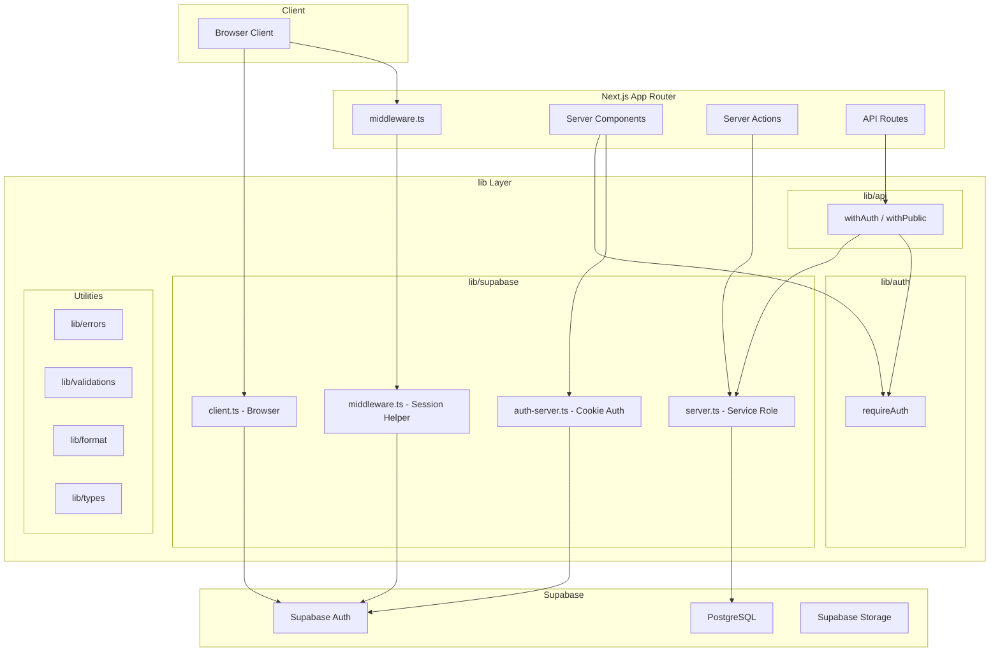
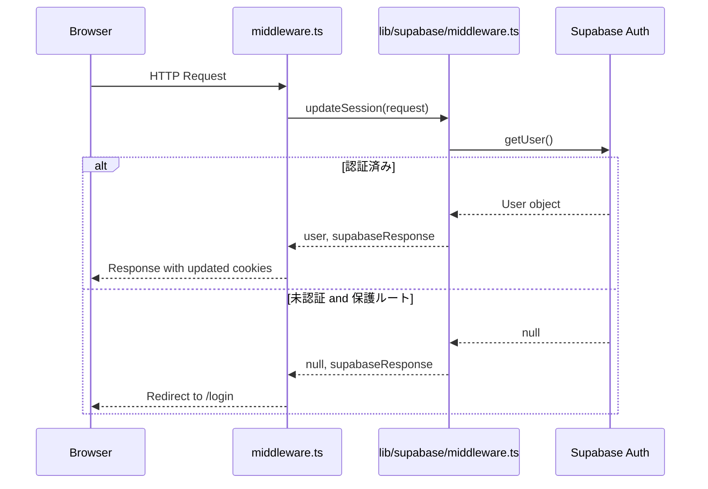
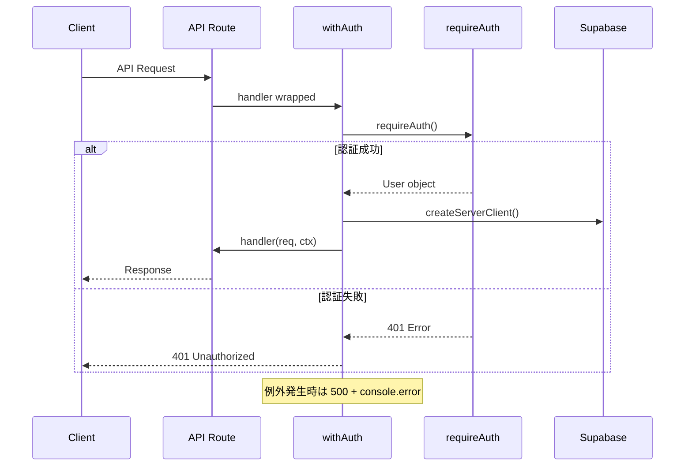

# Design Document: project-foundation

## Overview

**Purpose**: tos-sys の全機能が依存する技術基盤レイヤーを構築する。Supabase 連携（認証・DB・Storage）、共通ユーティリティ（エラーハンドリング・バリデーション・フォーマット）、UIコンポーネントライブラリの初期化を含む。

**Users**: 開発者（自分自身）が後続の機能開発で利用する共通インフラ。

**Impact**: create-next-app のボイラープレートに、Supabase バックエンド統合と共通ユーティリティレイヤーを追加する。

### Goals
- Supabase Auth による認証基盤の確立（シングルユーザー）
- サーバー/クライアント両方で利用可能な Supabase クライアントの提供
- 統一されたエラーハンドリング・バリデーション・フォーマットパターンの確立
- shadcn/ui による UI コンポーネント基盤の初期化
- company_settings テーブルによる会社情報管理基盤の構築

### Non-Goals
- ログインページの UI 実装（Issue #2 で対応）
- マルチユーザー対応（サインアップ機能、ロール管理）
- Sentry によるエラー監視（後から追加可能な設計にする）
- 各機能のテーブルマイグレーション（各 Issue で対応）

## Architecture

### Architecture Pattern & Boundary Map



**Architecture Integration**:
- **Selected pattern**: レイヤードアーキテクチャ（lib/ 配下にインフラレイヤーを配置）
- **Domain boundaries**: Supabase クライアント / 認証 / API ハンドラー / ユーティリティの4領域に分離
- **Existing patterns preserved**: Next.js App Router の規約（Server Components デフォルト）
- **New components rationale**: 全て新規作成（グリーンフィールド）。streamer-manager のパターンを簡素化して移植
- **Steering compliance**: TypeScript strict mode、Tailwind CSS v4、pnpm 使用

### Technology Stack

| Layer | Choice / Version | Role in Feature | Notes |
|-------|------------------|-----------------|-------|
| Frontend | shadcn/ui + Tailwind CSS v4 | UI コンポーネント基盤 | `npx shadcn@latest init` で初期化 |
| Backend | Next.js 16 + React 19 | App Router, Server Actions, API Routes | 既存 |
| Data | Supabase PostgreSQL | company_settings テーブル | RLS 有効 |
| Auth | Supabase Auth + @supabase/ssr | Cookie ベースセッション管理 | email/password のみ |
| Validation | Zod | リクエスト・フォームバリデーション | |
| PDF | @react-pdf/renderer ^4 | 請求書・見積もり PDF 生成（後続 Issue） | React 19 互換 v4 以上 |
| Date | date-fns | 日付フォーマット・計算 | |

## System Flows

### セッション管理フロー



### API ハンドラーフロー



## Requirements Traceability

| Requirement | Summary | Components | Interfaces | Flows |
|-------------|---------|------------|------------|-------|
| 1.1-1.6 | パッケージインストール・shadcn/ui 初期化 | package.json, components.json | - | - |
| 2.1 | サーバーサイド Supabase クライアント | lib/supabase/server.ts | createServerClient() | - |
| 2.2 | ブラウザ用 Supabase クライアント | lib/supabase/client.ts | createBrowserClient() | - |
| 2.3 | サーバーサイド認証用クライアント | lib/supabase/auth-server.ts | createAuthServerClient() | セッション管理 |
| 2.4 | 環境変数バリデーション | lib/supabase/server.ts, client.ts | Error throw | - |
| 3.1-3.4 | セッション管理ミドルウェア | middleware.ts, lib/supabase/middleware.ts | updateSession() | セッション管理 |
| 4.1-4.5 | 認証ヘルパー（シングルユーザー） | lib/auth/index.ts | requireAuth() | API ハンドラー |
| 5.1-5.4 | API ハンドラーラッパー | lib/api/handler.ts | withAuth(), withPublic() | API ハンドラー |
| 6.1-6.4 | エラーハンドリング | lib/errors/index.ts | clientError(), apiError(), notFoundError() | - |
| 7.1-7.4 | バリデーションユーティリティ | lib/validations/index.ts | parseRequest(), parseBody() | - |
| 8.1-8.3 | フォーマットユーティリティ | lib/format.ts | formatCurrency(), formatDate() | - |
| 9.1-9.4 | 会社設定テーブル | supabase/migrations/ | company_settings DDL + RLS | - |
| 10.1-10.2 | 型定義 | lib/types/database.ts | Database type placeholder | - |
| 11.1-11.3 | 環境変数・ビルド | .env.example, .gitignore | - | - |

## Components and Interfaces

| Component | Domain/Layer | Intent | Req Coverage | Key Dependencies | Contracts |
|-----------|-------------|--------|--------------|-----------------|-----------|
| lib/supabase/server.ts | Infra / Supabase | サービスロール Supabase クライアント生成 | 2.1, 2.4 | @supabase/supabase-js (P0) | Service |
| lib/supabase/client.ts | Infra / Supabase | ブラウザ用 Supabase クライアント生成 | 2.2, 2.4 | @supabase/ssr (P0) | Service |
| lib/supabase/auth-server.ts | Infra / Supabase | サーバーサイド認証用クライアント | 2.3 | @supabase/ssr (P0), next/headers (P0) | Service |
| lib/supabase/middleware.ts | Infra / Supabase | セッション更新ヘルパー | 3.1, 3.2, 3.4 | @supabase/ssr (P0) | Service |
| middleware.ts | Infra / Next.js | ルートレベルミドルウェア | 3.1, 3.3 | lib/supabase/middleware.ts (P0) | - |
| lib/auth/index.ts | Auth | 認証チェックヘルパー | 4.1-4.5 | lib/supabase/auth-server.ts (P0) | Service |
| lib/api/handler.ts | API | API Route ラッパー | 5.1-5.4 | lib/auth (P0), lib/supabase/server.ts (P0), lib/errors (P1) | Service |
| lib/errors/index.ts | Utils | 統一エラーレスポンス | 6.1-6.4 | - | Service |
| lib/validations/index.ts | Utils | Zod バリデーションヘルパー | 7.1-7.4 | zod (P0) | Service |
| lib/format.ts | Utils | 通貨・日付フォーマット | 8.1-8.3 | date-fns (P0) | Service |
| lib/types/database.ts | Types | Supabase 型定義 | 10.1-10.2 | - | - |
| .env.example | Config | 環境変数テンプレート | 11.1, 11.3 | - | - |
| company_settings migration | Data | 会社設定テーブル DDL | 9.1-9.4 | Supabase PostgreSQL (P0) | - |

### Infra / Supabase

#### lib/supabase/server.ts

| Field | Detail |
|-------|--------|
| Intent | サービスロールキーを使用するサーバーサイド Supabase クライアントの生成 |
| Requirements | 2.1, 2.4 |

**Responsibilities & Constraints**
- `SUPABASE_SERVICE_ROLE_KEY` を使用して RLS をバイパスするクライアントを提供
- サーバーサイド（Server Components, API Routes, Server Actions）からのみ使用可能
- 環境変数が未設定の場合、明確なエラーメッセージをスロー

**Dependencies**
- External: `@supabase/supabase-js` — Supabase クライアント SDK (P0)

**Contracts**: Service [x]

##### Service Interface
```typescript
import { SupabaseClient } from '@supabase/supabase-js'

function createServerClient(): SupabaseClient
```
- Preconditions: `NEXT_PUBLIC_SUPABASE_URL` と `SUPABASE_SERVICE_ROLE_KEY` が設定済み
- Postconditions: 有効な SupabaseClient を返す
- Invariants: サービスロールキーで RLS バイパス可能

#### lib/supabase/client.ts

| Field | Detail |
|-------|--------|
| Intent | ブラウザ用 Supabase クライアントの生成 |
| Requirements | 2.2, 2.4 |

**Responsibilities & Constraints**
- `"use client"` ディレクティブが必要
- anon キーを使用（RLS 適用下）

**Dependencies**
- External: `@supabase/ssr` — SSR 対応 Supabase クライアント (P0)

**Contracts**: Service [x]

##### Service Interface
```typescript
import { SupabaseClient } from '@supabase/supabase-js'

function createBrowserClient(): SupabaseClient
```

#### lib/supabase/auth-server.ts

| Field | Detail |
|-------|--------|
| Intent | Cookie ベースのセッション管理対応サーバーサイド認証クライアント |
| Requirements | 2.3 |

**Responsibilities & Constraints**
- `next/headers` の `cookies()` を使用して Cookie を読み書き
- Server Components では Cookie 設定が失敗するが、middleware が代行するため問題なし

**Dependencies**
- External: `@supabase/ssr` (P0), `next/headers` (P0)

**Contracts**: Service [x]

##### Service Interface
```typescript
import { SupabaseClient } from '@supabase/supabase-js'

function createAuthServerClient(): Promise<SupabaseClient>
```
- Postconditions: Cookie 管理対応の SupabaseClient を返す（async — cookies() が async のため）

#### lib/supabase/middleware.ts

| Field | Detail |
|-------|--------|
| Intent | ミドルウェアでのセッション更新ヘルパー |
| Requirements | 3.1, 3.2, 3.4 |

**Dependencies**
- External: `@supabase/ssr` (P0)

**Contracts**: Service [x]

##### Service Interface
```typescript
import { NextRequest, NextResponse } from 'next/server'
import { User } from '@supabase/supabase-js'

function updateSession(request: NextRequest): Promise<{
  user: User | null
  supabaseResponse: NextResponse
}>
```
- Preconditions: 有効な NextRequest
- Postconditions: セッション Cookie をリフレッシュした NextResponse を返す

### Infra / Next.js

#### middleware.ts（ルートレベル）

| Field | Detail |
|-------|--------|
| Intent | 全リクエストのセッション管理と保護ルートへのアクセス制御 |
| Requirements | 3.1, 3.3 |

**Responsibilities & Constraints**
- `updateSession()` を呼び出してセッションを更新
- 未認証ユーザーが `(app)` 配下のルートにアクセスした場合、`/login` にリダイレクト
- 静的ファイル（`_next/static`, `_next/image`, `favicon.ico`）は除外

**Dependencies**
- Inbound: Next.js runtime — 全リクエストで自動実行 (P0)
- Outbound: `lib/supabase/middleware.ts` — セッション更新 (P0)

**Implementation Notes**
- `config.matcher` でパブリックルート（`/login`, `/api/auth`）と静的ファイルを除外
- 認証チェックの粒度はルートレベル（ページ単位の細かいチェックは `requireAuth` で対応）

### Auth

#### lib/auth/index.ts

| Field | Detail |
|-------|--------|
| Intent | シングルユーザー向け認証チェックヘルパー |
| Requirements | 4.1-4.5 |

**Responsibilities & Constraints**
- シングルユーザー専用設計（ロール管理なし）
- email/password 認証のみ
- サインアップ機能なし

**Dependencies**
- Outbound: `lib/supabase/auth-server.ts` — 認証済みユーザー取得 (P0)

**Contracts**: Service [x]

##### Service Interface
```typescript
import { User } from '@supabase/supabase-js'
import { NextResponse } from 'next/server'

// API Route 用（エラーレスポンスを返す）
function requireAuth(): Promise<{
  user: User | null
  errorResponse: NextResponse | null
}>

// Server Component / Page 用（未認証時は redirect() を throw するため、戻り値は常に User）
function requireAuthPage(): Promise<User>
```
- Preconditions: なし
- Postconditions (requireAuth): 認証済み → `{ user, errorResponse: null }`、未認証 → `{ user: null, errorResponse: 401 }`
- Postconditions (requireAuthPage): 認証済み → User、未認証 → `/login` にリダイレクト（`redirect()` を使用）

### API

#### lib/api/handler.ts

| Field | Detail |
|-------|--------|
| Intent | API Route の認証・エラーハンドリング共通ラッパー |
| Requirements | 5.1-5.4 |

**Dependencies**
- Outbound: `lib/auth/index.ts` (P0), `lib/supabase/server.ts` (P0), `lib/errors/index.ts` (P1)

**Contracts**: Service [x]

##### Service Interface
```typescript
import { NextRequest, NextResponse } from 'next/server'
import { User } from '@supabase/supabase-js'
import { SupabaseClient } from '@supabase/supabase-js'

interface ApiContext<P extends Record<string, string> = Record<string, string>> {
  supabase: SupabaseClient
  user: User
  params: P
}

interface PublicContext<P extends Record<string, string> = Record<string, string>> {
  supabase: SupabaseClient
  params: P
}

type ApiHandler<P extends Record<string, string>> = (
  req: NextRequest,
  ctx: ApiContext<P>
) => Promise<NextResponse>

function withAuth<P extends Record<string, string> = Record<string, string>>(
  handler: ApiHandler<P>
): (req: NextRequest, routeCtx?: { params: Promise<P> }) => Promise<NextResponse>

function withPublic<P extends Record<string, string> = Record<string, string>>(
  handler: (req: NextRequest, ctx: PublicContext<P>) => Promise<NextResponse>
): (req: NextRequest, routeCtx?: { params: Promise<P> }) => Promise<NextResponse>
```
- Preconditions (withAuth): リクエストに有効なセッション Cookie が必要
- Postconditions: ハンドラーに `supabase`, `user`, `params` を提供。例外時は 500 エラーレスポンス
- Invariants: 全ての例外がキャッチされ、エラーレスポンスとして返される

### Utils

#### lib/errors/index.ts

| Field | Detail |
|-------|--------|
| Intent | 統一エラーレスポンス生成 |
| Requirements | 6.1-6.4 |

**Contracts**: Service [x]

##### Service Interface
```typescript
import { NextResponse } from 'next/server'

function clientError(message: string, status?: number): NextResponse
// Default status: 400. Returns { error: message }

function notFoundError(resourceName: string): NextResponse
// Returns { error: "${resourceName}が見つかりません" } with status 404

function apiError(
  error: unknown,
  route: string,
  method: string
): NextResponse
// Logs error via console.error, returns { error: "サーバーエラーが発生しました" } with status 500
```

#### lib/validations/index.ts

| Field | Detail |
|-------|--------|
| Intent | Zod スキーマによるリクエストバリデーションヘルパーと共通スキーマ |
| Requirements | 7.1-7.4 |

**Dependencies**
- External: `zod` (P0)

**Contracts**: Service [x]

##### Service Interface
```typescript
import { z } from 'zod'
import { NextResponse } from 'next/server'

// 共通スキーマ
const dateSchema: z.ZodString  // YYYY-MM-DD 形式
const uuidSchema: z.ZodString  // UUID 形式

// バリデーションヘルパー
function parseBody<T>(
  schema: z.ZodSchema<T>,
  body: unknown
): { success: true; data: T } | { success: false; error: NextResponse }

function parseRequest<T>(
  schema: z.ZodSchema<T>,
  req: Request
): Promise<{ success: true; data: T } | { success: false; error: NextResponse }>
```
- Postconditions (parseBody): 有効 → `{ success: true, data }`、無効 → `{ success: false, error: 400 with field errors }`
- Postconditions (parseRequest): JSON パース失敗 → 400 エラー、その他は parseBody と同じ

#### lib/format.ts

| Field | Detail |
|-------|--------|
| Intent | ja-JP ロケールでの通貨・日付フォーマット |
| Requirements | 8.1-8.3 |

**Dependencies**
- External: `date-fns` (P0)

**Contracts**: Service [x]

##### Service Interface
```typescript
// 通貨フォーマット: 1234 → "¥1,234"
function formatCurrency(amount: number): string

// 日付フォーマット
function formatDate(date: Date | string, format?: string): string
// Default format: "yyyy/MM/dd"
// Available formats: "yyyy年M月d日", "yyyy/MM/dd", "yyyy-MM-dd"

// 日付フォーマット（長い形式）: "2026年3月19日"
function formatDateLong(date: Date | string): string
```
- Invariants: サーバーサイド・クライアントサイドの両方で動作（`"use client"` 不要）

## Data Models

### Physical Data Model

#### company_settings テーブル

```sql
create table company_settings (
  key text primary key,
  value text not null,
  updated_at timestamptz not null default now()
);

-- RLS ポリシー
alter table company_settings enable row level security;

create policy "認証済みユーザーは全設定を読み取れる"
  on company_settings for select
  to authenticated
  using (true);

create policy "認証済みユーザーは設定を更新できる"
  on company_settings for update
  to authenticated
  using (true)
  with check (true);

create policy "認証済みユーザーは設定を挿入できる"
  on company_settings for insert
  to authenticated
  with check (true);

-- 初期データ
insert into company_settings (key, value) values
  ('company_name', ''),
  ('address', ''),
  ('bank_info', ''),
  ('invoice_registration_number', ''),
  ('phone', ''),
  ('email', '');
```

**設計判断**: key-value 形式を採用。将来の設定項目追加でマイグレーション不要（詳細は `research.md` 参照）。

**RLS 方針**: シングルユーザーのため、`authenticated` ロールに対してシンプルな全許可ポリシーを適用。`user_id` カラムは不要（全レコードが同一ユーザーに属する）。

## Error Handling

### Error Strategy
- **API Routes**: `withAuth` / `withPublic` ラッパーが try-catch で全例外をキャッチし、`apiError()` で 500 レスポンスを返す
- **バリデーション**: `parseRequest()` / `parseBody()` が Zod エラーを 400 レスポンスに変換
- **認証**: `requireAuth()` が未認証を 401 レスポンスに変換

### Error Categories and Responses
- **User Errors (4xx)**: `clientError(message, status)` — バリデーション失敗、認証失敗、リソース未存在
- **System Errors (5xx)**: `apiError(error, route, method)` — 予期しない例外、DB エラー

### Monitoring
- 初期段階: `console.error` + Vercel Runtime Logs
- 将来: Sentry 追加可能な設計（`apiError` 関数に Sentry 送信を追加するだけ）

## Testing Strategy

テストスイートなし（steering/tech.md の方針に従い、動作確認は実際のアプリで行う）。

### 手動検証項目
- `pnpm build` が通ること
- 環境変数未設定時にエラーメッセージが表示されること
- Supabase クライアントが各コンテキスト（Server Component, Client Component, API Route）で動作すること

## Security Considerations

- **認証**: Supabase Auth の email/password 認証（サインアップ機能なし）
- **RLS**: 全テーブルで RLS 有効。`authenticated` ロールに対するポリシーで制御
- **環境変数**: `SUPABASE_SERVICE_ROLE_KEY` はサーバーサイドのみで使用（`NEXT_PUBLIC_` プレフィックスなし）
- **Cookie**: Supabase Auth の httpOnly, secure Cookie によるセッション管理
