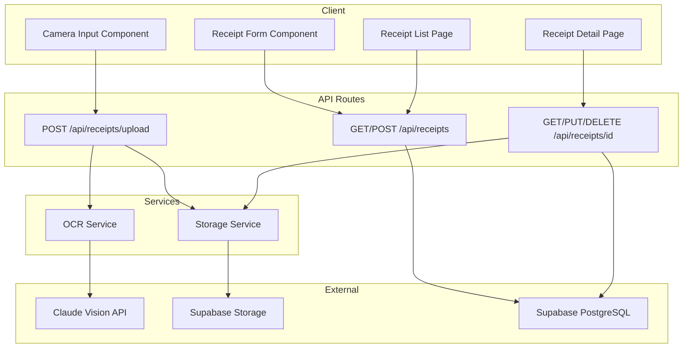
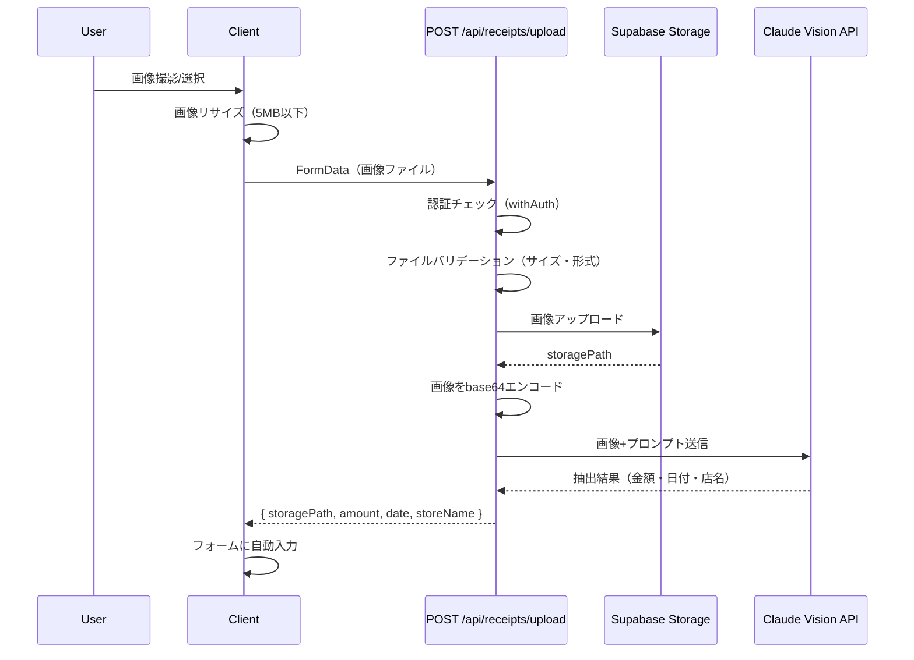
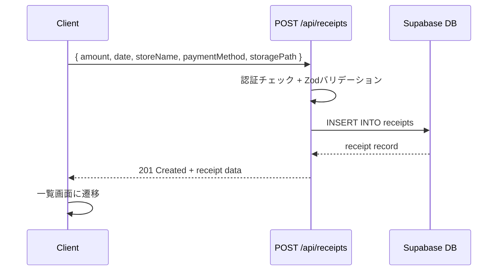

# Design Document — receipt-capture

## Overview

**Purpose**: 領収書の撮影・取り込みからOCR自動読み取り、立替区分管理までを一貫して提供し、経費記録の効率化を実現する。

**Users**: tos-sysのシングルユーザーが、モバイル端末またはデスクトップから領収書を登録・管理する。

**Impact**: 経費管理機能の中核として、新規DBテーブル・Storage bucket・API Route・ページを追加する。

### Goals
- 領収書画像の撮影/選択→OCR自動読み取り→保存の一連のフローを実現
- 立替区分（カード・現金・その他）による経費分類
- モバイルファーストのレスポンシブUI

### Non-Goals
- 経費精算レポートの生成（将来機能）
- 複数ユーザーの経費承認ワークフロー（シングルユーザー前提）
- 領収書データのCSVエクスポート（将来機能）
- 他システム（会計ソフト等）との連携

## Architecture

### Architecture Pattern & Boundary Map



**Architecture Integration**:
- Selected pattern: Next.js App Router + Route Handler（既存パターン踏襲）
- Domain boundaries: クライアント（画像入力・フォーム）/ API（認証・ビジネスロジック）/ 外部サービス（OCR・Storage・DB）
- Existing patterns preserved: `withAuth` APIハンドラー、`parseRequest` Zodバリデーション、Supabaseクライアント
- New components rationale: OCRサービスとStorageサービスを分離し、テスタビリティと責務分離を確保

### Technology Stack

| Layer | Choice / Version | Role in Feature | Notes |
|-------|------------------|-----------------|-------|
| Frontend | React 19 + shadcn/ui | 撮影UI、フォーム、一覧・詳細 | クライアントコンポーネント（カメラ操作） |
| Backend | Next.js 16 Route Handler | API Routes | `withAuth`パターン踏襲 |
| OCR | @anthropic-ai/sdk + Claude Sonnet 4.5 | 領収書画像解析 | `claude-sonnet-4-5-20250514` |
| Data | Supabase PostgreSQL | receiptsテーブル | RLS有効 |
| Storage | Supabase Storage | 領収書画像保存 | `receipts`バケット |
| Validation | Zod | リクエスト・フォームバリデーション | 既存`parseRequest`活用 |

## System Flows

### 領収書アップロード＆OCR解析フロー



**Key Decisions**:
- アップロードとOCR解析を1つのAPI Routeで同時実行し、ラウンドトリップを削減
- OCR失敗時も画像アップロードは成功として扱い、手動入力にフォールバック

### 領収書保存フロー



## Requirements Traceability

| Requirement | Summary | Components | Interfaces | Flows |
|-------------|---------|------------|------------|-------|
| 1.1-1.2 | カメラ撮影/ギャラリー選択 | CameraInput | — | アップロードフロー |
| 1.3 | 画像アップロード→OCR開始 | CameraInput, UploadAPI | POST /api/receipts/upload | アップロードフロー |
| 1.4 | アップロードエラー処理 | CameraInput, UploadAPI | POST /api/receipts/upload | アップロードフロー |
| 1.5 | JPEG/PNG形式サポート | UploadAPI | POST /api/receipts/upload | — |
| 1.6 | 画像サイズ上限（5MB） | CameraInput, UploadAPI | POST /api/receipts/upload | — |
| 2.1 | OCR自動読み取り | OCRService, UploadAPI | POST /api/receipts/upload | アップロードフロー |
| 2.2 | 読み取り結果の自動入力・編集 | ReceiptForm | — | — |
| 2.3 | ローディングインジケーター | CameraInput | — | — |
| 2.4 | OCR失敗時の手動入力フォールバック | ReceiptForm, UploadAPI | POST /api/receipts/upload | — |
| 2.5 | 金額を整数抽出 | OCRService | — | — |
| 3.1-3.3 | 立替区分の選択・保存 | ReceiptForm | POST /api/receipts | 保存フロー |
| 4.1-4.4 | データ保存・バリデーション | ReceiptForm, ReceiptsAPI | POST /api/receipts | 保存フロー |
| 5.1-5.3 | 一覧・詳細表示 | ReceiptList, ReceiptDetail | GET /api/receipts | — |
| 5.4 | 編集機能 | ReceiptDetail | PUT /api/receipts/:id | — |
| 5.5 | 削除機能 | ReceiptDetail | DELETE /api/receipts/:id | — |
| 6.1-6.3 | モバイル対応・レスポンシブ | 全UIコンポーネント | — | — |

## Components and Interfaces

| Component | Domain/Layer | Intent | Req Coverage | Key Dependencies | Contracts |
|-----------|-------------|--------|--------------|-----------------|-----------|
| CameraInput | UI | 画像撮影/選択とプレビュー | 1.1-1.6, 2.3 | — | State |
| ReceiptForm | UI | 領収書データ入力フォーム | 2.2, 2.4, 3.1-3.3, 4.1-4.4 | CameraInput (P1) | State |
| ReceiptList | UI/Page | 領収書一覧ページ | 5.1-5.2 | ReceiptsAPI (P0) | — |
| ReceiptDetail | UI/Page | 領収書詳細・編集・削除ページ | 5.3-5.5 | ReceiptByIdAPI (P0) | — |
| UploadAPI | API | 画像アップロード＋OCR解析 | 1.3-1.6, 2.1, 2.4-2.5 | OCRService (P0), StorageService (P0) | API |
| ReceiptsAPI | API | 領収書CRUD（一覧・作成） | 4.1-4.4, 5.1-5.2 | Supabase DB (P0) | API |
| ReceiptByIdAPI | API | 領収書CRUD（詳細・更新・削除） | 5.3-5.5 | Supabase DB (P0), StorageService (P1) | API |
| OCRService | Service | Claude Vision APIによるOCR解析 | 2.1, 2.5 | Claude API (P0) | Service |
| StorageService | Service | Supabase Storageへの画像CRUD | 1.3, 5.5 | Supabase Storage (P0) | Service |

### UI Layer

#### CameraInput

| Field | Detail |
|-------|--------|
| Intent | カメラ撮影またはギャラリーから画像を取得し、プレビュー表示・リサイズを行うクライアントコンポーネント |
| Requirements | 1.1, 1.2, 1.3, 1.4, 1.5, 1.6, 2.3 |

**Responsibilities & Constraints**
- HTML5 `<input type="file" accept="image/jpeg,image/png" capture="environment">` でカメラ/ギャラリー対応
- クライアント側で画像を5MB以下にリサイズ（Canvas API使用）
- プレビュー表示、ローディング状態管理
- `"use client"` 指定必須

**Dependencies**
- External: Canvas API — 画像リサイズ (P1)

**Contracts**: State [x]

##### State Management
```typescript
interface CameraInputState {
  file: File | null
  previewUrl: string | null
  isUploading: boolean
  error: string | null
}

interface CameraInputProps {
  onUploadComplete: (result: UploadResult) => void
  onError: (error: string) => void
}

interface UploadResult {
  storagePath: string
  ocrResult: OCRResult
}

interface OCRResult {
  amount: number | null      // 整数（円）
  date: string | null        // YYYY-MM-DD
  storeName: string | null   // 店名/支払先
}
```

**Implementation Notes**
- モバイルでは`capture="environment"`でリアカメラ起動
- リサイズはCanvas APIの`toBlob`でJPEG品質を調整して5MB以下に
- アップロードはFormDataでRoute Handlerに送信

#### ReceiptForm

| Field | Detail |
|-------|--------|
| Intent | OCR結果の確認・編集と立替区分選択を行い、領収書データを保存するフォーム |
| Requirements | 2.2, 2.4, 3.1, 3.2, 3.3, 4.1, 4.2, 4.3, 4.4 |

**Responsibilities & Constraints**
- OCR結果をフォームに自動入力、ユーザーが編集可能
- 立替区分（カード・現金・その他）の選択UI
- Zodスキーマによるクライアント側バリデーション
- `"use client"` 指定必須

**Dependencies**
- Inbound: CameraInput — OCR結果受け渡し (P0)
- Outbound: POST /api/receipts — データ保存 (P0)

**Contracts**: State [x]

##### State Management
```typescript
type PaymentMethod = 'card' | 'cash' | 'other'

interface ReceiptFormData {
  amount: number              // 整数（円）
  date: string                // YYYY-MM-DD
  storeName: string           // 店名/支払先
  paymentMethod: PaymentMethod
  storagePath: string         // Storage内の画像パス
}
```

**Implementation Notes**
- shadcn/ui: Input, Select (or RadioGroup), Button, Label
- 金額フィールドは`type="number"`で整数入力

#### ReceiptList（サマリーのみ）

サーバーコンポーネント。`app/receipts/page.tsx`に配置。日付降順で一覧表示し、各行に金額・日付・店名・立替区分を表示。

#### ReceiptDetail（サマリーのみ）

`app/receipts/[id]/page.tsx`に配置。サーバーコンポーネントでデータ取得、編集・削除はクライアントコンポーネントで処理。Storage画像はsigned URLで表示。

### API Layer

#### UploadAPI

| Field | Detail |
|-------|--------|
| Intent | 画像ファイルを受け取り、Storageに保存し、OCR解析結果を返す |
| Requirements | 1.3, 1.4, 1.5, 1.6, 2.1, 2.4, 2.5 |

**Responsibilities & Constraints**
- 認証チェック（`withAuth`）
- ファイルバリデーション（サイズ5MB以下、MIME type: image/jpeg, image/png）
- Supabase Storageへのアップロード
- Claude Vision APIへのOCR解析リクエスト
- OCR失敗時はnull値で正常レスポンス

**Dependencies**
- Outbound: OCRService — OCR解析 (P0)
- Outbound: StorageService — 画像保存 (P0)

**Contracts**: API [x]

##### API Contract

| Method | Endpoint | Request | Response | Errors |
|--------|----------|---------|----------|--------|
| POST | /api/receipts/upload | FormData (file: File) | `{ storagePath: string, ocrResult: OCRResult }` | 400 (invalid file), 401, 500 |

#### ReceiptsAPI

| Field | Detail |
|-------|--------|
| Intent | 領収書データの一覧取得と新規作成 |
| Requirements | 4.1, 4.2, 4.3, 4.4, 5.1, 5.2 |

**Dependencies**
- External: Supabase PostgreSQL — データ永続化 (P0)

**Contracts**: API [x]

##### API Contract

| Method | Endpoint | Request | Response | Errors |
|--------|----------|---------|----------|--------|
| GET | /api/receipts | query: ?page, ?limit | `{ data: Receipt[], total: number }` | 401, 500 |
| POST | /api/receipts | `ReceiptCreateRequest` | `Receipt` | 400, 401, 500 |

```typescript
interface ReceiptCreateRequest {
  amount: number              // 正の整数（円）
  date: string                // YYYY-MM-DD
  store_name: string
  payment_method: PaymentMethod
  storage_path: string
}

interface Receipt {
  id: string                  // UUID
  amount: number
  date: string
  store_name: string
  payment_method: PaymentMethod
  storage_path: string
  created_at: string
  updated_at: string
}
```

#### ReceiptByIdAPI

| Field | Detail |
|-------|--------|
| Intent | 個別領収書の詳細取得・更新・削除 |
| Requirements | 5.3, 5.4, 5.5 |

**Contracts**: API [x]

##### API Contract

| Method | Endpoint | Request | Response | Errors |
|--------|----------|---------|----------|--------|
| GET | /api/receipts/[id] | — | `Receipt` | 401, 404, 500 |
| PUT | /api/receipts/[id] | `ReceiptUpdateRequest` | `Receipt` | 400, 401, 404, 500 |
| DELETE | /api/receipts/[id] | — | `{ success: true }` | 401, 404, 500 |

```typescript
interface ReceiptUpdateRequest {
  amount?: number
  date?: string
  store_name?: string
  payment_method?: PaymentMethod
}
```

### Service Layer

#### OCRService

| Field | Detail |
|-------|--------|
| Intent | Claude Vision APIを使用して領収書画像からテキスト情報を抽出する |
| Requirements | 2.1, 2.5 |

**Responsibilities & Constraints**
- 画像をbase64エンコードしてClaude APIに送信
- 構造化されたJSON形式でレスポンスを抽出
- 金額は整数（円単位）で返却
- 解析失敗時はnull値を返却（例外を投げない）

**Dependencies**
- External: @anthropic-ai/sdk — Claude Vision API呼び出し (P0)

**Contracts**: Service [x]

##### Service Interface
```typescript
interface OCRServiceInterface {
  analyzeReceipt(imageBase64: string, mediaType: 'image/jpeg' | 'image/png'): Promise<OCRResult>
}

interface OCRResult {
  amount: number | null
  date: string | null
  storeName: string | null
}
```
- Preconditions: imageBase64は有効なbase64文字列、mediaTypeはJPEGまたはPNG
- Postconditions: OCRResultを返却。解析失敗時は各フィールドがnull
- Invariants: amountがnullでない場合は正の整数

**Implementation Notes**
- モデル: `claude-sonnet-4-5-20250514`（環境変数`OCR_MODEL`で上書き可能）
- プロンプト: 日本語領収書から金額（整数・円）、日付（YYYY-MM-DD）、店名を抽出しJSON形式で返すよう指示
- max_tokens: 256（短い構造化レスポンスのみ）

#### StorageService

| Field | Detail |
|-------|--------|
| Intent | Supabase Storageとの画像CRUD操作を抽象化する |
| Requirements | 1.3, 5.5 |

**Dependencies**
- External: Supabase Storage — ファイル操作 (P0)

**Contracts**: Service [x]

##### Service Interface
```typescript
interface StorageServiceInterface {
  upload(file: Buffer, fileName: string, contentType: string): Promise<string>  // storagePath
  getSignedUrl(storagePath: string): Promise<string>
  delete(storagePath: string): Promise<void>
}
```
- Preconditions: fileは5MB以下のバイナリデータ
- Postconditions: uploadはStorage内のパスを返却
- Invariants: storagePathの形式は `receipts/{userId}/{timestamp}_{fileName}`

## Data Models

### Domain Model

- **Aggregate Root**: Receipt（領収書）
- **Value Objects**: PaymentMethod（立替区分）
- **Business Rules**:
  - 金額は正の整数（円単位）
  - 日付はYYYY-MM-DD形式
  - 立替区分は 'card' | 'cash' | 'other' のいずれか
  - 各領収書は1つの画像と紐づく

### Physical Data Model

```sql
-- receiptsテーブル
create table receipts (
  id uuid primary key default gen_random_uuid(),
  amount integer not null check (amount > 0),
  date date not null,
  store_name text not null default '',
  payment_method text not null check (payment_method in ('card', 'cash', 'other')),
  storage_path text not null,
  created_at timestamptz not null default now(),
  updated_at timestamptz not null default now()
);

-- インデックス
create index idx_receipts_date on receipts (date desc);

-- RLSポリシー
alter table receipts enable row level security;

create policy "認証済みユーザーは全領収書を操作可能"
  on receipts for all to authenticated
  using (true) with check (true);
```

```sql
-- Supabase Storage バケット作成（SQLで管理）
insert into storage.buckets (id, name, public)
  values ('receipts', 'receipts', false);

-- Storage RLSポリシー
create policy "認証済みユーザーは領収書画像をアップロード可能"
  on storage.objects for insert to authenticated
  with check (bucket_id = 'receipts');

create policy "認証済みユーザーは領収書画像を閲覧可能"
  on storage.objects for select to authenticated
  using (bucket_id = 'receipts');

create policy "認証済みユーザーは領収書画像を削除可能"
  on storage.objects for delete to authenticated
  using (bucket_id = 'receipts');
```

### Data Contracts & Integration

**API Data Transfer**
- Request/Response: JSON形式
- バリデーション: Zodスキーマ（サーバー側 `parseRequest`）

```typescript
import { z } from 'zod'

const receiptCreateSchema = z.object({
  amount: z.number().int().positive(),
  date: z.string().regex(/^\d{4}-\d{2}-\d{2}$/),
  store_name: z.string().min(1),
  payment_method: z.enum(['card', 'cash', 'other']),
  storage_path: z.string().min(1),
})

const receiptUpdateSchema = z.object({
  amount: z.number().int().positive().optional(),
  date: z.string().regex(/^\d{4}-\d{2}-\d{2}$/).optional(),
  store_name: z.string().min(1).optional(),
  payment_method: z.enum(['card', 'cash', 'other']).optional(),
})
```

## Error Handling

### Error Categories and Responses

**User Errors (4xx)**:
- 400: 無効なファイル形式/サイズ → 「JPEG/PNG形式で5MB以下の画像を選択してください」
- 400: バリデーションエラー → Zodのフィールドエラーメッセージ（既存`parseRequest`パターン）
- 401: 未認証 → `requireAuth`のエラーレスポンス（既存パターン）
- 404: 領収書が見つからない → 「指定された領収書が見つかりません」

**System Errors (5xx)**:
- OCR解析失敗 → null値で正常レスポンス返却（エラーにしない）。フォームで手動入力を促す
- Storageアップロード失敗 → 500エラー + リトライ可能メッセージ
- DB操作失敗 → `apiError`関数（既存パターン）で処理

## Testing Strategy

テストスイートなし（tech.md準拠）。動作確認は実際のアプリで行う。

主要な確認項目:
- カメラ撮影/ギャラリー選択が動作するか（モバイル実機）
- OCR解析で日本語領収書から金額・日付・店名が抽出されるか
- 立替区分の選択・保存が正しく動作するか
- 一覧・詳細・編集・削除のCRUD操作
- 5MB超の画像がリジェクトされるか

## Security Considerations

- **APIキー管理**: `ANTHROPIC_API_KEY`はサーバー側環境変数のみ。クライアントに露出しない
- **認証**: 全API Routeに`withAuth`適用。未認証リクエストを拒否
- **RLS**: receiptsテーブルとStorageバケットにRLSポリシー適用
- **ファイルバリデーション**: サーバー側でMIMEタイプとファイルサイズを検証
- **画像保存**: privateバケットで保存。signed URLで時限的アクセスのみ許可
