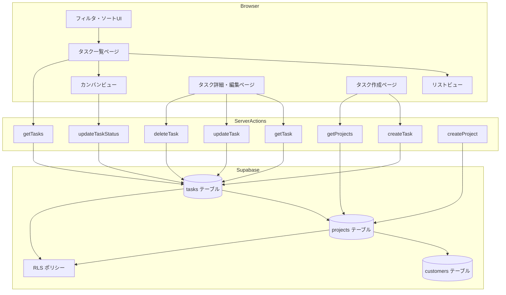
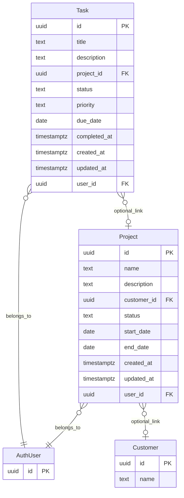

# 設計書: task-management

## Overview

タスク管理機能は、プロジェクトとタスクの進捗管理を提供する。ユーザーはタスクの作成・閲覧・編集・削除を行い、ステータス・優先度・期限でフィルタ・ソートして管理する。リストビューとカンバンビュー（ステータス別列表示）の切り替え、プロジェクト別グルーピングをサポートする。

**Purpose**: タスクの進捗を一元管理し、期限切れの見落とし防止とプロジェクト単位での作業整理を実現する。
**Users**: システム管理者（シングルユーザー）が日常の作業管理で使用する。
**Impact**: 既存の `(app)/tasks` プレースホルダーを完全なタスク管理機能に置き換え、`projects` / `tasks` テーブルを新規追加する。

### Goals
- プロジェクト・タスクのCRUD操作を提供する
- リストビューとカンバンビューの切り替えを実現する
- ステータス・優先度・プロジェクトによるフィルタ・ソート・グルーピングを提供する
- 期限切れタスクの視覚的ハイライトを実装する

### Non-Goals
- ドラッグ&ドロップによるカンバン操作
- プロジェクト専用の管理ページ（プロジェクトCRUD Actionsのみ提供）
- タスクの担当者割り当て（シングルユーザーのため不要）
- ガントチャートやカレンダービュー
- タスクのサブタスク・階層構造

## Architecture

### Existing Architecture Analysis

customer-management機能がServer Actions + `createAuthServerClient` + Zodバリデーション + RLSの完全なリファレンスパターンとして存在する。タスク管理はこのパターンを2テーブル構成（projects + tasks）に拡張する。

### Architecture Pattern & Boundary Map



**Architecture Integration**:
- **Selected pattern**: Server Actions + Server Components（customer-managementと同一パターン）
- **Domain boundaries**: `lib/actions/task.ts`・`lib/actions/project.ts`（データ操作）、`lib/validations/task.ts`・`lib/validations/project.ts`（バリデーション）、`components/tasks/`（UI）
- **Existing patterns preserved**: ActionState型、Zodバリデーション、createAuthServerClient、revalidatePath + redirect
- **New components rationale**: カンバンビュー（TaskKanban）は新規UIパターン。2テーブル構成に伴いActionsが2ファイルに分割
- **Steering compliance**: TypeScript strict mode、shadcn/ui使用、Supabase Auth + RLS

### Technology Stack

| Layer | Choice / Version | Role in Feature | Notes |
|-------|------------------|-----------------|-------|
| Frontend | Next.js 16 + React 19 | Server Components + Client Components | useActionState for forms |
| UI | shadcn/ui | Card, Badge, Table, Dialog, Button, Input, Label, Select, Textarea | 既存インストール済みコンポーネントを活用 |
| Backend | Next.js Server Actions | CRUD操作 | `"use server"` ディレクティブ |
| Validation | Zod | フォーム・サーバーサイドバリデーション | project/task 2スキーマ |
| Data | Supabase PostgreSQL | projects + tasks テーブル + RLS | `createAuthServerClient` 使用 |

## Requirements Traceability

| Requirement | Summary | Components | Interfaces |
|-------------|---------|------------|------------|
| 1.1 | projectsテーブル定義 | マイグレーションSQL | — |
| 1.2 | projects status CHECK | マイグレーションSQL | — |
| 1.3 | マイグレーションファイル | マイグレーションSQL | — |
| 2.1 | tasksテーブル定義 | マイグレーションSQL | — |
| 2.2 | tasks status CHECK | マイグレーションSQL | — |
| 2.3 | tasks priority CHECK | マイグレーションSQL | — |
| 2.4 | マイグレーションファイル | マイグレーションSQL | — |
| 3.1 | projects RLS | マイグレーションSQL | — |
| 3.2 | tasks RLS | マイグレーションSQL | — |
| 4.1 | project name必須 | projectSchema | Zodスキーマ |
| 4.2 | project status検証 | projectSchema | Zodスキーマ |
| 4.3 | task title必須 | taskSchema | Zodスキーマ |
| 4.4 | task status検証 | taskSchema | Zodスキーマ |
| 4.5 | task priority検証 | taskSchema | Zodスキーマ |
| 4.6 | 共通バリデーション | projectSchema, taskSchema | Zodスキーマ |
| 5.1 | プロジェクトCRUD | project actions | ActionState |
| 5.2 | Zodバリデーション | project actions | projectSchema |
| 5.3 | Supabaseクライアント | project actions | createAuthServerClient |
| 5.4 | エラーハンドリング | project actions | ActionState |
| 6.1 | タスクCRUD+ステータス変更 | task actions | ActionState |
| 6.2 | Zodバリデーション | task actions | taskSchema |
| 6.3 | Supabaseクライアント | task actions | createAuthServerClient |
| 6.4 | completed_at自動設定（done時） | updateTaskStatus | — |
| 6.5 | completed_at null設定（done以外） | updateTaskStatus | — |
| 6.6 | エラーハンドリング | task actions | ActionState |
| 7.1 | リスト表示 | TasksPage, TaskList | getTasks |
| 7.2 | リスト/カンバン切り替え | TasksPage, ViewToggle | searchParams |
| 7.3 | カンバンビュー | TaskKanban, TaskCard | — |
| 7.4 | タスク情報表示 | TaskList, TaskCard | — |
| 7.5 | 新規作成導線 | TasksPage | — |
| 7.6 | 詳細導線 | TaskList, TaskCard | — |
| 8.1 | ステータスフィルタ | TaskFilters, getTasks | searchParams |
| 8.2 | 優先度フィルタ | TaskFilters, getTasks | searchParams |
| 8.3 | プロジェクトフィルタ | TaskFilters, getTasks | searchParams |
| 8.4 | プロジェクト別グルーピング | TasksPage, getTasks | searchParams |
| 8.5 | ソート | TaskFilters, getTasks | searchParams |
| 8.6 | 0件メッセージ | TaskList, TaskKanban | — |
| 9.1 | 期限表示 | TaskList, TaskCard | — |
| 9.2 | 期限切れハイライト | TaskList, TaskCard | date-fns |
| 9.3 | 期限ソート | TaskFilters, getTasks | searchParams |
| 10.1 | 作成フォーム表示 | NewTaskPage, TaskForm | — |
| 10.2 | 入力フィールド | TaskForm | — |
| 10.3 | 作成処理 | TaskForm, createTask | ActionState |
| 10.4 | バリデーションエラー表示 | TaskForm | ActionState |
| 10.5 | ローディング状態 | TaskForm | useActionState |
| 11.1 | 詳細表示 | TaskDetailPage, TaskDetail | getTask |
| 11.2 | 編集機能 | TaskDetailPage, TaskForm | — |
| 11.3 | 更新処理 | TaskForm, updateTask | ActionState |
| 11.4 | 一覧戻る導線 | TaskDetailPage | — |
| 11.5 | 404表示 | TaskDetailPage | notFound |
| 11.6 | 削除機能 | DeleteTaskDialog, deleteTask | — |
| 11.7 | 確認ダイアログ | DeleteTaskDialog | — |
| 12.1 | ビルド成功 | 全体 | — |

## Components and Interfaces

| Component | Domain/Layer | Intent | Req Coverage | Key Dependencies | Contracts |
|-----------|-------------|--------|--------------|------------------|-----------|
| projectSchema | Validation | プロジェクトデータバリデーション | 4.1, 4.2, 4.6 | Zod (P0) | — |
| taskSchema | Validation | タスクデータバリデーション | 4.3, 4.4, 4.5, 4.6 | Zod (P0) | — |
| project actions | Server Actions | プロジェクトCRUD操作 | 5.1-5.4 | createAuthServerClient (P0), projectSchema (P0) | Service |
| task actions | Server Actions | タスクCRUD+ステータス変更 | 6.1-6.6 | createAuthServerClient (P0), taskSchema (P0) | Service |
| TasksPage | Page | 一覧ページ（Server Component） | 7.1-7.6, 8.1-8.6, 9.1-9.3 | getTasks (P0), getProjects (P1) | — |
| TaskFilters | UI (Client) | フィルタ・ソート・ビュー切替UI | 7.2, 8.1-8.5, 9.3 | useRouter (P0) | State |
| TaskList | UI (Server) | リストビュー表示 | 7.1, 7.4, 7.6, 8.6, 9.1, 9.2 | shadcn Table (P0), date-fns (P1) | — |
| TaskKanban | UI (Server) | カンバンビュー表示 | 7.3, 7.4, 7.6, 8.6, 9.1, 9.2 | TaskCard (P0) | — |
| TaskCard | UI (Server) | カンバン用カードコンポーネント | 7.3, 7.4, 9.1, 9.2 | shadcn Card, Badge (P0) | — |
| TaskForm | UI (Client) | 作成・編集フォーム | 10.1-10.5, 11.2, 11.3 | useActionState (P0), taskSchema (P1) | State |
| TaskDetail | UI (Server) | 詳細表示 | 11.1, 11.4 | shadcn Card (P1) | — |
| DeleteTaskDialog | UI (Client) | 削除確認ダイアログ | 11.6, 11.7 | shadcn Dialog (P0), deleteTask (P0) | — |
| NewTaskPage | Page | 新規作成ページ | 10.1 | TaskForm (P0), getProjects (P1) | — |
| TaskDetailPage | Page | 詳細・編集ページ（Server Component） | 11.1, 11.5 | getTask (P0), getProjects (P1) | — |

### Validation Layer

#### projectSchema

| Field | Detail |
|-------|--------|
| Intent | プロジェクトデータの入力バリデーションスキーマ |
| Requirements | 4.1, 4.2, 4.6 |

**Responsibilities & Constraints**
- 作成・更新の両方で使用する共通スキーマ
- name は必須
- status は 'active' | 'completed' | 'on_hold' | 'cancelled' に制限

**Contracts**: Service [x]

##### Service Interface
```typescript
// lib/validations/project.ts

const projectStatusSchema = z.enum(['active', 'completed', 'on_hold', 'cancelled'])
type ProjectStatus = z.infer<typeof projectStatusSchema>

const projectBaseSchema = z.object({
  name: z.string().min(1, 'プロジェクト名は必須です'),
  description: z.string().optional(),
  customer_id: z.string().uuid().optional().nullable(),
  status: projectStatusSchema.optional(),
  start_date: z.string().optional().nullable(),
  end_date: z.string().optional().nullable(),
})

const projectCreateSchema = projectBaseSchema
type ProjectCreateInput = z.infer<typeof projectCreateSchema>

const projectUpdateSchema = projectBaseSchema.extend({
  status: projectStatusSchema.optional(),
})
type ProjectUpdateInput = z.infer<typeof projectUpdateSchema>
```

#### taskSchema

| Field | Detail |
|-------|--------|
| Intent | タスクデータの入力バリデーションスキーマ |
| Requirements | 4.3, 4.4, 4.5, 4.6 |

**Responsibilities & Constraints**
- 作成・更新の両方で使用する共通スキーマ
- title は必須
- status は 'todo' | 'in_progress' | 'done' | 'cancelled' に制限
- priority は 'low' | 'medium' | 'high' | 'urgent' に制限

**Contracts**: Service [x]

##### Service Interface
```typescript
// lib/validations/task.ts

const taskStatusSchema = z.enum(['todo', 'in_progress', 'done', 'cancelled'])
type TaskStatus = z.infer<typeof taskStatusSchema>

const taskPrioritySchema = z.enum(['low', 'medium', 'high', 'urgent'])
type TaskPriority = z.infer<typeof taskPrioritySchema>

const taskBaseSchema = z.object({
  title: z.string().min(1, 'タイトルは必須です'),
  description: z.string().optional(),
  project_id: z.string().uuid().optional().nullable(),
  status: taskStatusSchema.optional(),
  priority: taskPrioritySchema.optional(),
  due_date: z.string().optional().nullable(),
})

const taskCreateSchema = taskBaseSchema
type TaskCreateInput = z.infer<typeof taskCreateSchema>

const taskUpdateSchema = taskBaseSchema.extend({
  status: taskStatusSchema.optional(),
  priority: taskPrioritySchema.optional(),
})
type TaskUpdateInput = z.infer<typeof taskUpdateSchema>
```

### Server Actions Layer

#### project actions

| Field | Detail |
|-------|--------|
| Intent | プロジェクトデータのCRUD操作をServer Actionsとして提供 |
| Requirements | 5.1, 5.2, 5.3, 5.4 |

**Responsibilities & Constraints**
- `"use server"` ディレクティブで宣言
- `createAuthServerClient` を使用しRLSを活用
- 操作前にZodバリデーションを実行
- エラー時は `ActionState` 形式で返却

**Dependencies**
- Outbound: Supabase — データベース操作 (P0)
- Outbound: projectSchema — バリデーション (P0)

**Contracts**: Service [x]

##### Service Interface
```typescript
// lib/actions/project.ts

// 一覧取得
function getProjects(params?: {
  status?: ProjectStatus | 'all'
}): Promise<Project[]>

// 単一取得
function getProject(id: string): Promise<Project | null>

// 作成
function createProject(
  prevState: ActionState,
  formData: FormData
): Promise<ActionState>

// 更新
function updateProject(
  id: string,
  prevState: ActionState,
  formData: FormData
): Promise<ActionState>

// 削除
function deleteProject(id: string): Promise<ActionState>
```

- Preconditions: 認証済みユーザーのセッションが有効であること
- Postconditions: 成功時は `revalidatePath('/tasks')` 実行
- Invariants: user_id は自動的にRLSで制約される

#### task actions

| Field | Detail |
|-------|--------|
| Intent | タスクデータのCRUD+ステータス変更をServer Actionsとして提供 |
| Requirements | 6.1, 6.2, 6.3, 6.4, 6.5, 6.6 |

**Responsibilities & Constraints**
- `"use server"` ディレクティブで宣言
- `createAuthServerClient` を使用しRLSを活用
- ステータスが 'done' に変更された場合、`completed_at` を現在日時に設定
- ステータスが 'done' 以外に変更された場合、`completed_at` を null に設定
- タスク削除は物理削除（customerの論理削除とは異なる）

**Dependencies**
- Outbound: Supabase — データベース操作 (P0)
- Outbound: taskSchema — バリデーション (P0)

**Contracts**: Service [x]

##### Service Interface
```typescript
// lib/actions/task.ts

type TaskWithProject = Task & {
  projects: { id: string; name: string } | null
}

// 一覧取得（プロジェクト名をJOIN）
function getTasks(params?: {
  status?: TaskStatus | 'all'
  priority?: TaskPriority | 'all'
  projectId?: string | 'all'
  sortBy?: 'priority' | 'due_date' | 'created_at'
  sortOrder?: 'asc' | 'desc'
  // priority ソートはCASE式で重み付け: urgent=0, high=1, medium=2, low=3
  groupBy?: 'project'
}): Promise<TaskWithProject[]>

// 単一取得
function getTask(id: string): Promise<TaskWithProject | null>

// 作成
function createTask(
  prevState: ActionState,
  formData: FormData
): Promise<ActionState>

// 更新
function updateTask(
  id: string,
  prevState: ActionState,
  formData: FormData
): Promise<ActionState>

// ステータス変更（カンバンビューから直接呼び出し）
function updateTaskStatus(
  id: string,
  status: TaskStatus
): Promise<ActionState>

// 削除（物理削除）
function deleteTask(id: string): Promise<ActionState>
```

- Preconditions: 認証済みユーザーのセッションが有効であること
- Postconditions: 成功時は `revalidatePath('/tasks')` 実行。statusが'done'に変更時は`completed_at = now()`、それ以外は`completed_at = null`
- Invariants: user_id は自動的にRLSで制約される

### UI Layer

#### TaskFilters

| Field | Detail |
|-------|--------|
| Intent | フィルタ・ソート・ビュー切替のUI操作を提供 |
| Requirements | 7.2, 8.1, 8.2, 8.3, 8.4, 8.5, 9.3 |

**Responsibilities & Constraints**
- `"use client"` コンポーネント
- URL searchParamsを更新してServer Componentの再レンダリングをトリガー
- `useRouter` + `useSearchParams` で状態管理
- CustomerSearchBarと同じパターン

**Contracts**: State [x]

##### State Management
```typescript
// components/tasks/task-filters.tsx

interface TaskFiltersProps {
  projects: Project[]  // プロジェクトフィルタ用
  defaultView?: 'list' | 'kanban'
  defaultStatus?: string
  defaultPriority?: string
  defaultProjectId?: string
  defaultSortBy?: string
  defaultSortOrder?: string
  defaultGroupBy?: string
}

// URL searchParams:
// ?view=list|kanban&status=todo&priority=high&projectId=xxx&sortBy=due_date&sortOrder=asc&groupBy=project
```

#### TaskForm

| Field | Detail |
|-------|--------|
| Intent | タスク情報の入力フォーム（作成・編集兼用） |
| Requirements | 10.1-10.5, 11.2, 11.3 |

**Responsibilities & Constraints**
- `"use client"` コンポーネント
- `useActionState` で Server Action の実行と状態管理
- 編集時は既存データをプリフィル
- プロジェクト選択はSelectコンポーネントで一覧を表示
- ローディング中はボタン無効化

**Contracts**: State [x]

##### State Management
```typescript
// components/tasks/task-form.tsx

interface TaskFormProps {
  task?: TaskWithProject  // 編集時に既存データを渡す
  projects: Project[]     // プロジェクト選択用
  action: (prevState: ActionState, formData: FormData) => Promise<ActionState>
}
```

#### DeleteTaskDialog

| Field | Detail |
|-------|--------|
| Intent | タスク削除の確認ダイアログ |
| Requirements | 11.6, 11.7 |

**Responsibilities & Constraints**
- `"use client"` コンポーネント
- shadcn/ui の Dialog を使用
- 確認後に `deleteTask` Server Action を実行（物理削除）

**Implementation Notes**
- ダイアログ内にタスクタイトルを表示して誤削除を防止
- 削除後は一覧ページにリダイレクト

#### TaskList（Summary-only）

リストビューのテーブル表示。shadcn/ui Tableを使用。各行にタイトル、ステータスBadge、優先度Badge、プロジェクト名、期限を表示。期限切れは赤色テキストでハイライト（date-fnsの`isPast`で判定）。

#### TaskKanban（Summary-only）

カンバンビュー。CSS Grid 4列レイアウト（todo / in_progress / done / cancelled）。各列にTaskCardを配置。

#### TaskCard（Summary-only）

カンバン用カードコンポーネント。shadcn/ui Card + Badgeを使用。タイトル、優先度Badge、プロジェクト名、期限を表示。期限切れハイライト対応。詳細ページへのリンク。

## Data Models

### Domain Model



**Business Rules & Invariants**:
- Project.name は必須
- Project.status は 'active' | 'completed' | 'on_hold' | 'cancelled'
- Task.title は必須
- Task.status は 'todo' | 'in_progress' | 'done' | 'cancelled'
- Task.priority は 'low' | 'medium' | 'high' | 'urgent'
- Task.completed_at はステータスが 'done' の場合のみ非null
- Project.customer_id は ON DELETE SET NULL
- Task.project_id は ON DELETE SET NULL
- タスク削除は物理削除

### Physical Data Model

```sql
-- supabase/migrations/YYYYMMDDHHMMSS_create_projects.sql

create table projects (
  id uuid primary key default gen_random_uuid(),
  name text not null,
  description text,
  customer_id uuid references customers(id) on delete set null,
  status text not null default 'active' check (status in ('active', 'completed', 'on_hold', 'cancelled')),
  start_date date,
  end_date date,
  created_at timestamptz not null default now(),
  updated_at timestamptz not null default now(),
  user_id uuid not null references auth.users(id)
);

create index idx_projects_user_id on projects (user_id);
create index idx_projects_status on projects (status);

alter table projects enable row level security;

create policy "ユーザーは自身のプロジェクトのみ参照可能"
  on projects for select to authenticated
  using (auth.uid() = user_id);

create policy "ユーザーは自身のプロジェクトのみ作成可能"
  on projects for insert to authenticated
  with check (auth.uid() = user_id);

create policy "ユーザーは自身のプロジェクトのみ更新可能"
  on projects for update to authenticated
  using (auth.uid() = user_id)
  with check (auth.uid() = user_id);

create policy "ユーザーは自身のプロジェクトのみ削除可能"
  on projects for delete to authenticated
  using (auth.uid() = user_id);

-- updated_at自動更新トリガー（共通関数がなければ作成）
create or replace function update_updated_at_column()
returns trigger as $$
begin
  new.updated_at = now();
  return new;
end;
$$ language plpgsql;

create trigger projects_updated_at
  before update on projects
  for each row execute function update_updated_at_column();
```

```sql
-- supabase/migrations/YYYYMMDDHHMMSS_create_tasks.sql

create table tasks (
  id uuid primary key default gen_random_uuid(),
  title text not null,
  description text,
  project_id uuid references projects(id) on delete set null,
  status text not null default 'todo' check (status in ('todo', 'in_progress', 'done', 'cancelled')),
  priority text not null default 'medium' check (priority in ('low', 'medium', 'high', 'urgent')),
  due_date date,
  completed_at timestamptz,
  created_at timestamptz not null default now(),
  updated_at timestamptz not null default now(),
  user_id uuid not null references auth.users(id)
);

create index idx_tasks_user_id on tasks (user_id);
create index idx_tasks_status on tasks (status);
create index idx_tasks_priority on tasks (priority);
create index idx_tasks_project_id on tasks (project_id);
create index idx_tasks_due_date on tasks (due_date);

create trigger tasks_updated_at
  before update on tasks
  for each row execute function update_updated_at_column();

alter table tasks enable row level security;

create policy "ユーザーは自身のタスクのみ参照可能"
  on tasks for select to authenticated
  using (auth.uid() = user_id);

create policy "ユーザーは自身のタスクのみ作成可能"
  on tasks for insert to authenticated
  with check (auth.uid() = user_id);

create policy "ユーザーは自身のタスクのみ更新可能"
  on tasks for update to authenticated
  using (auth.uid() = user_id)
  with check (auth.uid() = user_id);

create policy "ユーザーは自身のタスクのみ削除可能"
  on tasks for delete to authenticated
  using (auth.uid() = user_id);
```

### Data Contracts

```typescript
// lib/types/project.ts

interface Project {
  id: string
  name: string
  description: string | null
  customer_id: string | null
  status: 'active' | 'completed' | 'on_hold' | 'cancelled'
  start_date: string | null
  end_date: string | null
  created_at: string
  updated_at: string
  user_id: string
}
```

```typescript
// lib/types/task.ts

interface Task {
  id: string
  title: string
  description: string | null
  project_id: string | null
  status: 'todo' | 'in_progress' | 'done' | 'cancelled'
  priority: 'low' | 'medium' | 'high' | 'urgent'
  due_date: string | null
  completed_at: string | null
  created_at: string
  updated_at: string
  user_id: string
}
```

## Error Handling

### Error Strategy
Server Actionsは `ActionState` 形式でエラーを返却する（customer-managementと同じパターン）。

### Error Categories and Responses
- **バリデーションエラー**: Zodの `safeParse` 失敗 → フィールド別エラーメッセージを `ActionState.errors` に格納
- **認証エラー**: `createAuthServerClient` でセッション無効 → middleware が `/login` にリダイレクト
- **データ不存在**: 詳細・編集ページで該当IDなし → `notFound()` 呼び出し（Next.js 404）
- **DB操作エラー**: Supabaseクエリ失敗 → `ActionState.message` に汎用エラーメッセージ

## Testing Strategy

テストスイートなし（steering: `tech.md` に記載の通り）。動作確認は実際のアプリで行う:
- タスクの作成・閲覧・編集・削除の手動確認
- リスト/カンバンビューの切り替え確認
- フィルタ・ソート・グルーピングの動作確認
- 期限切れハイライトの確認
- バリデーションエラー表示の確認
- `pnpm build` の成功確認

## Security Considerations

- **RLS**: user_idベースのRow Level Securityで他ユーザーのデータにアクセス不可（projects, tasks両テーブル）
- **認証**: middleware + `createAuthServerClient` で二重の認証チェック
- **入力サニタイズ**: Zodバリデーションで不正な入力を排除
- **CSRF**: Next.js Server Actionsは自動的にCSRF対策を提供
- **外部キー制約**: ON DELETE SET NULLで参照整合性を維持

## File Structure

```
lib/
  actions/
    project.ts           # Project Server Actions (CRUD)
    task.ts              # Task Server Actions (CRUD + ステータス変更)
  validations/
    project.ts           # Zodバリデーションスキーマ
    task.ts              # Zodバリデーションスキーマ
  types/
    project.ts           # Project型定義
    task.ts              # Task型定義

components/
  tasks/
    task-form.tsx        # 作成・編集フォーム
    task-list.tsx        # リストビュー（テーブル）
    task-kanban.tsx      # カンバンビュー
    task-card.tsx        # カンバン用カード
    task-filters.tsx     # フィルタ・ソート・ビュー切替UI
    task-detail.tsx      # 詳細表示
    delete-task-dialog.tsx  # 削除確認ダイアログ

app/(app)/
  tasks/
    page.tsx             # 一覧ページ（既存プレースホルダー置換）
    new/
      page.tsx           # 新規作成ページ
    [id]/
      page.tsx           # 詳細・編集ページ

supabase/migrations/
  YYYYMMDDHHMMSS_create_projects.sql
  YYYYMMDDHHMMSS_create_tasks.sql
```
